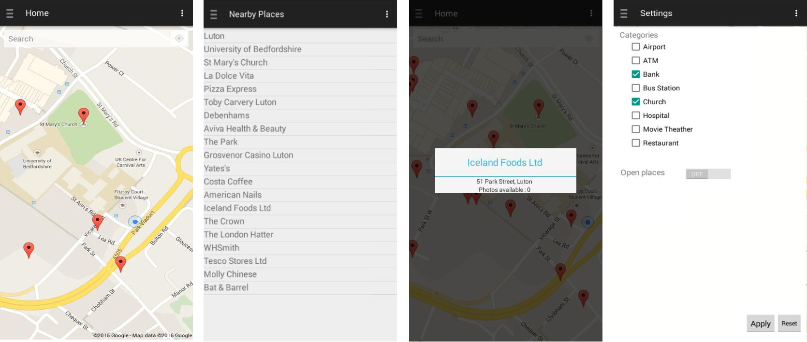

## MobRec Android Application

MobRec application recommends places, by category, to a user according to its preferences. After entering the application, a Google Maps and marked places is presented. The shown places are obtained by the ‘nearbySearch’ method from Places API.

It is possible for the user to see a list of near places by clicking on 'Nearby Places' tab, at the menu. The goal of this app is to allow users, such as travelers, to know places that surround him without a very detailed search on the internet.

The technologies used were Google Places API and Maps API. Besides Java, XML, JSON and IDE Android Studio.

Screenshots:

